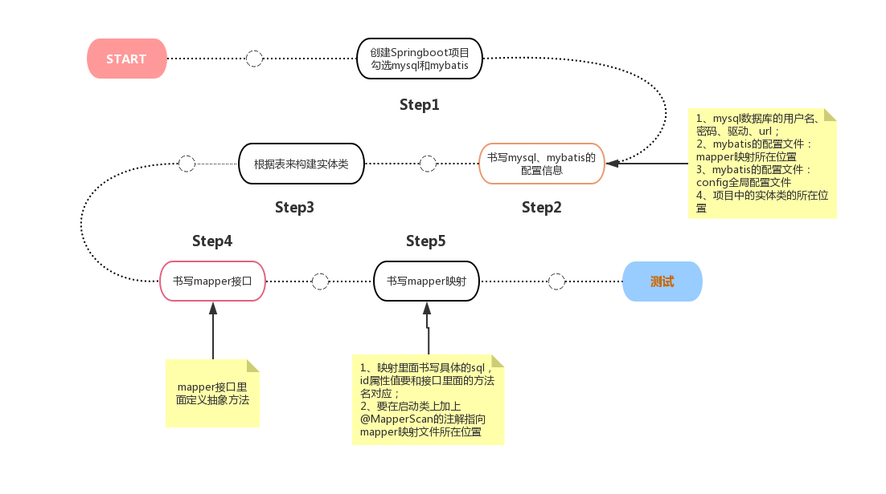

# springboot
## springboot基本介绍
### 什么是springboot
- Springboot相对于Spring来说是一套全新框架，来自于Spring家族，因此Spring所具备的功能它都有且更易使用；
同时简化了基于Spring的应用开发，通过少量代码就能创建一个独立的，产品级别的Spring应用。
- Springboot默认配置了很多框架的使用方式，就像maven整合了所有的jar包，Spring整合了所有的框架。它的核心思想是：约定由于配置，Spring所有开发细节都是依据此思想进行实现的。

什么是微服务
- 微服务是一种架构风格，它要求我们在开发一个应用的时候，这个应用必须构建成一系列小服务的组合；可以通过http的方式进行互通。

什么是单体架构
- 指我们将一个应用中的所有服务都封装在一个应用中。把数据库访问，web访问，等等各个功能放到一个war包内  
单体架构有缺点：
- 优点：易于开发和测试；方便部署；需要扩展时将war包复制多份，然后放到多个服务器上，做负载均衡即可
- 缺点：项目臃肿；资源无法隔离；无法灵活扩展

什么是微服务架构
- 微服务架构，就是打破之前all in one的架构方式，把每个功能元素独立出来。
把独立出来的功能元素的动态组合，需要的功能元素才拿来去组合，需要多一些时可以组合多个功能元素。

如何构建微服务
- 一个大型的微服务架构，就像一个复杂交织的神经网络，每个神经元就是一个功能元素，他们完成各自的功能，然后通过http或者RPC互相请求调用。
- 构建一个个功能独立的微服务应用单元，可以使用springboot，可以快速帮我们构建一个应用。
- 大型分布式网络服务的调用，这部分由spring cloud完成，实现分布式。
- 在分布式中间，进行流式数据计算、批处理，采用springcloud data flow

## 1.springboot原理
### 1.1 Springboot启动类解析
@SpringbootApplication
- @SpringBootConfiguration： springboot的配置类-》》@Configuration：标明这是一个配置类--》@Components：加载到spring容器  
- @EnableAutoConfiguration： 开启自动配置功能  
    1.@AutoConfigurationPackage： 自动配置包  
         1.1@Import({Registrar.class})： 把启动类所在的包进行默认扫描，该包下所有类都会扫描到spring容器中进行管理  
    2.@Import({AutoConfigurationImportSelector.class})： 加载自定类到容器中  
           2.1AutoConfigurationImportSelector：自动配置导入选择器  
           根据项目判断项目需要哪些配置信息然后把默认的配置内容导入到spring容器中进行管理
- @ComponentScan： 组件扫描、自动装配注解,用来指定容器扫描的范围

### 1.2 Springboot配置
- Springboot中的配置文件
    1. 方便修改默认配置
    2. 其他信息保存在配置文件中
    3. 配置文件有：  
    1）properties配置文件  
    2）yml配置文件
    4. 配置文件使用注意事项  
    1）文件放在src/main/resource目录或者类路径config目录下  
    2）springboot默认读取以application开头的配置文件
- yml文件的语法说明（https://yaml.org）  
yml文件介绍：全称为YAML（YAML Ain't Markup Language）它是一种标记语言，直观的被电脑识别的数据序列化格式，并且容易被人类阅读，
这种标记语言与其他标记语言不同的是，它是以数据为中心，比json、xml等更适合做配置文件。  
yml的基本语法：  
    1. key: value的格式（value前面的空格不能少，可以有多个，不能用tab替代）
    2. 大小写敏感
    3. 字符串默认不需要使用引号，单引号和双引号的区别在于是否能用转义字符
    4. 注释方式:#
    5. 支持的三种数据类型：
        - 字面量：直接量，单个不能被拆分的值（数字、字符串、布尔）
        - 对象：键值对形式存在
        - 数组：字面量/对象的集合
        
    yml文件的读取操作
    1. 三种书写方式：${字面量}、${配置文件中的取值}以及${spEL表达式}  
- 自定义properties的读取
    1. 自定义一个properties文件，并且让key和之前的properties不一样;
    2. 使用propertysource注解来标明你要读取的properties文件名：@PropertySource("classpath:person.properties")
    3. 跟之前一样的读取方式，注意修改prefix的值;
	
properties注入方式：
- @ConfigurationProperties(prefix = "xxx")
- @Value("${person.name}")
- @Value("#{11*3}")

### 1.3 使用Springboot进行Web开发
前期准备：
- 熟悉Thymeleaf语法
- 熟悉spring、springMVC中的相关操作
- 熟悉拦截器
- 熟悉springboot搭建项目过程
- 了解Bootstrap
- 准备一套web静态页面（登录页面、信息展示页面）
- IDEA开发工具

构建一个Springboot项目，并把静态资源放到项目中：  
1.css、js、img等资源放到static目录中  
2.html等模板代码放到template目录  
3.修改配置文件  
4.启动，测试是否正常  

设置主页的默认访问方式  
通过修改WebMvcConfigure的默认设置来指定页面的默认访问方式  
1、构建一个配置类，实现WebMvcConfigure接口，重写addViewControllers方法；  
2、添加自定义页面的默认主页映射：addViewController().setViewName();  

**Springboot设置欢迎页面**  
一、使用index.html作为欢迎页面
- 静态页面  
Spring boot项目在启动后，首先会去静态资源路径（resource/static）下查找index.html作为首页文件
- 动态页面  
如果在静态资源路径（resource/static）下找不到index.html,则会在resource/templates目录下找index.html作为首页文件  

二、使用其他页面作为欢迎页面  
假设我们在 **resources/templates** 目录下有个 **login.html** 文件（使用 **Thymeleaf** 模版），想让它作为首页。

方式一：  
通过自定义一个 **Controller** 来实现，在 **Controller** 中返回逻辑视图名即可：
```java
@Controller
public class HelloController {
     @RequestMapping("/") 
     public String hello(){
         return "login";
     }
}
```
	
方式二：  
通过自定义一个 **MVC** 配置，并重写 **addViewControllers** 方法进行映射关系配置即可。	
```
@Controller
public class WebMvcConfig implements WebMvcConfigurer {
    @Override
    public void addViewControllers(ViewControllerRegistry registry){
        registry.addViewController("/").setViewName("forward:login.html");
    }
}
```

**拦截器功能**  
在WebMvcConfigure类里重写添加拦截器的方法，并进行业务的书写。

### 1.4 Restful介绍及使用  
URI：统一资源标识符，服务器上的每一种资源比如文档、图像、视频片段、程序都由一个通用资源标识符（Uniform Resource Identifier，简称URL）进行定位。  

**什么是REST**  
- REST（Representational State Transfer，表述性转移）一词由Roy Thomas Fielding在2000年博士论文中提出，定义了他对互联网软件架构的原则，因此我们可以说Rest是一种架构风格。  
**REST的原则**
- 网络上所有事物都被抽象为资源
- 每个资源都有一个唯一的资源标识符
- 同一个资源具有多种表现形式（xml，json等）
- 对资源的各种操作不会改变资源标识符
- 所有的操作都是无状态的

Restful通过不同的注解支持前端的请求  
- @GetMapping，处理Get请求
- @PostMapping，处理Post请求
- @PutMapping，用于更新资源
- @DeleteMapping，用于删除资源
- @PathMapping,用于更新部分资源

Controller中的映射注解
- @PathVariable，用于接收url路径上的参数
- @ModelAttribute，用于接收url?后面的参数，如uri?id=123&name=46,然后直接转为pojo

**RESTFUL开发流程**


**开启热部署**
```
<dependency>
	<groupId>org.springframework.boot</groupId>
	<artifactId>spring-boot-devtools</artifactId>
	<scope>runtime</scope>
	<optional>true</optional>
</dependency>

<build>
	<plugins>
		<!--工程打jar包插件-->
		<plugin>
			<groupId>org.springframework.boot</groupId>
			<artifactId>spring-boot-maven-plugin</artifactId>
			<!--开启热部署-->
			<configuration>
				<fork>true</fork>
			</configuration>
		</plugin>
	</plugins>
</build>
```


### 1.5 Spring Data Rest介绍  
- Spring Data项目的子集，开发者只需要使用注解@RepositoryRestResource标记，就可以把整个Repository转换为HAL风格的Rest资源，
目前已支持Spring Data JPA，Spring Data MongoDB，Spring Data Neoj4等等。  
- 简单的说，Spring Data Rest把我们需要编写的大量Rest模板接口做了自动化实现，并符合HAL的规范。  
- HAL(Hypertxt Application Language)是一个被广泛采用的超文本表达的规范。
- 官方文档：https://www.springcloud.cc/spring-data-rest-zhcn.html  

## 2 数据库访问中间件
### 2.1 MyBatis
#### 2.1.1 ORM框架和MyBatis介绍
ORM(Object Related Mapping)：对象映射关系，用于实现面向对象编程语言里不同类型系统的数据之间的转换。
简单的说，ORM是通过使用描述对象和数据库之间映射的元数据，将程序中的对象与关系数据库相互映射。
- 异构性：ORM可以解决数据库与程序之间的异构性，比如在Java中我们使用String表示字符串，
而Oracle中可使用varchar2，MySQL中使用varchar，SQLServer中使用nvarchar  
- 映射：ORM提供了实现持久层的另一种模式，采用映射数据元（XML）来描述对象-关系的映射细节，
使得ORM中间件能在任何一个Java应用的业务逻辑层和数据库之间充当桥梁。

经典的ORM框架
- Hibernate：全自动的框架，强大、复杂、笨重、学习成本高
- MyBatis：半自动框架（懂数据库的人才能操作）必须要自己写sql
- JPA：Java Persistence API，Java自带的框架

MyBatis介绍：
优秀的持久层框架（前身是Apache的一个开源项目iBatis），支持定制化SQL、存储过程及高级映射。  
可以使用简单的XML(mapper文件)或注解（写接口中的方法）来配置和映射原生信息，将接口和Java的POJOs（Plain Old Java Objects，普通的java对象）映射成数据库中的记录。

#### 2.1.2 MyBatis工作流程及架构说明

- 接口层：主要定义的是与数据库进行交互的方式（增删改查，接口调用方式基于StatementID/基于Mapper接口）
- 数据处理层：MyBatis核心，负责参数映射和动态SQL生成，生成之后MyBatis执行SQL语句，将返回的结果映射成自定义的类型
    1. 参数映射（ParameterHandler）：参数映射配置、参数映射解析、参数类型解析
    2. SQL解析（SqlSource）：SQL语句配置、SQL语句解析、SQL语句动态生成
    3. SQL执行（Executor）：SimpleExecutor、BatchExecutor、ReuseExecutor
    4. 结果处理和映射（ResultSetHandler）：结果映射配置、结果类型转换
- 框架支撑层：负责最基础的功能支撑，包括连接管理、事务管理、配置加载和缓存处理，为上层的数据处理层提供最基础的支撑。  
    SQL语句配置方式：基于XML配置、基于注解
- 引导层：基于XML配置方式、基于Java API方式


#### 2.1.3 MyBatis主要成员及层次结构
- Configuration
全局配置文件
映射配置文件：存储相关sql操作
- MappedStatement
    通过SqlSource生成动态SQL语句，并封装到BoundSql中
    ResultMap：自定义结果集
- BoundSql

层次结构：
SqlSession：作为MyBatis最顶层API，作为会话访问，完成数据库增删改查功能  
Executor：MyBatis执行器，调度的核心，负责SQL语句的生成和查询缓存的维护  
StatementHandler：负责所有处理JDBC的statement的交互  

#### 2.1.4 MyBatis的基本使用
1.pom引入MyBatis依赖：
```
<dependency>
    <groupId>org.mybatis</groupId>
    <artifactId>mybatis</artifactId>
    <version>3.4.6</version>
</dependency>
```
2.编写全局配置文件mybatis-config.xml
```xml
<?xml version="1.0" encoding="UTF-8" ?>
<!DOCTYPE configuration
        PUBLIC "-//mybatis.org//DTD Config 3.0//EN"
        "http://mybatis.org/dtd/mybatis-3-config.dtd">
<configuration>
    <environments default="development">
        <environment id="development">
<!--            事务管理器-->
            <transactionManager type="JDBC"/>
            <dataSource type="POOLED">
<!--                高版本的mysql需要使用到新的驱动写法-->
                <property name="driver" value="com.mysql.cj.jdbc.Driver"/>
<!--                如果有中文的话，是需要加上serverTimezone=UTC的时区，否则会报错-->
                <property name="url" value="jdbc:mysql://localhost:3306/testdb?serverTimezone=UTC"/>
                <property name="username" value="root"/>
                <property name="password" value="root"/>
            </dataSource>
        </environment>
    </environments>
    <mappers>
        <mapper resource="mapper/studentMapper.xml"/>
    </mappers>
</configuration>
```
3.编写实体类对应的mapper文件，记录对该实体类进行的SQL操作
```xml
<?xml version="1.0" encoding="UTF-8" ?>
<!DOCTYPE mapper PUBLIC "-//mybatis.org//DTD Mapper3.0//EN"
        "http://mybatis.org/dtd/mybatis-3-mapper.dtd">
<mapper namespace="com.study.springboot.dao.StudentMapper">
    <resultMap id="BaseResultMap" type="com.study.springboot.entity.Student" >
        <!--主键设置id，其他用result，column就是数据库的字段名，property就是实体类的属性名
        jdbcType就是该类型的字段名-->
        <id column="id" property="id" jdbcType="INTEGER" />
        <result column="name" property="name" jdbcType="VARCHAR" />
        <result column="sex" property="sex" jdbcType="VARCHAR" />
    </resultMap>
<!--根据id来查找对象-->
    <select id="findStudentById" resultType="com.study.springboot.entity.Student">
    SELECT id,name,sex from student where id=#{id}
    </select>
<!--根据用户名来模糊查找对象-->
    <select id="findStudentsByName" parameterType="String" resultType="com.study.springboot.entity.Student">
    SELECT id,name,sex from student where name like '%${value}%';
    </select>
<!--查找所有，这里的返回值使用resultType，放泛型里面的类型-->
    <select id="findAll" resultType="com.study.springboot.entity.Student">
        SELECT id,name,sex from student;
    </select>
<!--查找所有，这里的返回值用自定义的resultMap对象-->
    <select id="selectAll" resultMap="BaseResultMap">
        SELECT id,name,sex from student;
    </select>
<!--添加一个用户-->
    <insert id="insertStudent" parameterType="com.study.springboot.entity.Student">
    insert into student(name,sex) VALUES(#{name},'${sex}')
    </insert>
<!--修改一个用户-->
    <update id="updateStudent" parameterType="com.study.springboot.entity.Student">
    update student set name=#{name},sex=#{sex} where id=#{id}
    </update>
<!--删除一个用户-->
    <delete id="deleteStudent" parameterType="int">
    delete from student where id=#{id}
    </delete>
</mapper>
```
4.写入Mapper接口中  
5.构建实体类

#### 2.1.5 Springboot整合MyBatis流程

1. 创建Springboot项目勾选MyBatis和mysql
2. 书写mysql、mybatis配置信息：
    1. mysql数据库用户名、密码、驱动、url
    2. MyBatis映射配置文件：mapper映射所在位置:mybatis.mapper-locations=classpath:mybatis/mapper/*.xml
    3. MyBatis全局配置文件：config全局配置文件:mybatis.config-location=classpath:mybatis/mybatis-config.xml
    4. 项目实体类所在位置:mybatis.type-aliases-package=com.study.springboot.entity
    5. 展示sql语句配置：logging.level.com.study.springboot.repository=debug
3. 根据表构建实体类
4. 书写mapper接口
5. 书写mapper映射：
    1. 映射里书写具体的SQL，id属性要和接口里面的方法名对应
    2. 要在启动类上加上@MapperScan的注解指向mapper映射文件所在位置
	
占位符：
- #：@Select("select id, username,password,name from users where name like #{name}")  
查找:usersDao.findByName("%a%");
- %：@Select("select id, username,password,name from users where name like '%${name}%'")  
查找：usersDao.findByName("a");

**案例**
使用Springboot、热部署、MyBatis注解、lombok、Thymeleaf实现多表业务  
流程：  


多表查询
```java
public interface UsersRepository {
    @Select("select count(1) from Users where username=#{users.username} and password=#{users.password}")
    int login(@Param("users") Users users);

    //演示一对多中的1，这里是根据id来查users对象，那么我们可以结合ProductRepository来一次性把对应的product也查出来
    //property指的是在Users实体类中一对多中的多的属性名，column代表的是把users表中的那个字段作为后面查询的条件，many指的是查询是一对多还是一对一
    @Select("select * from Users where id=#{id}")
    @Results({
            @Result(
                    property = "products",column = "id",many = @Many(select = "com.study.mybatis.repository.ProductRepository.findByUid")
            )
    })
    Users findUsersById(int id);
}

```

### 2.1.6 Spring data jpa简介及快速入门
SpringData为了简化构建基于Spring框架应用的数据访问技术，包括关系型数据库、非关系数据库、Map-reduce框架、云数据服务等访问支持。
它为我们提供使用统一的API标准来对数据访问层进行操作，这套标准包含CRUD（创建、获取、更新、删除）、查询、排序和分页的相关操作。

Spring Data的特点
- 具备ORM框架的对象关系映射功能

统一的repository接口
- Repository<T, ID extends Serializable>:统一接口
- CrudRepository<T, ID extends Serializable>:基本CRUD操作
- PagingAndSortingRepository<T, ID extends Serializable>:基本CRUD及分页

统一的数据访问模板类
- 如MongoTemplate、RedisTemplate等

JPA是什么
- JPA（Java Persistence API）是Sun官方提出的Java持久化规范。为Java开发人员提供了一种对象/关联映射工具来管理Java应用中的关系数据。
它的出现主要是为了简化现有的持久化开发工作和整合ORM技术，结束现在Hibernate、TopLink、JDO等ORM框架各自为营的局面。
- 值得注意的是，JPA是在充分吸收了现有的Hibernate、TopLink、JDO等ORM框架的基础上发展而来的，具有易于使用、伸缩性强等优点。

注意：JPA是一套规范，不是一套产品，那么像Hibernate、TopLink、JDO它们是一套产品，如果说这些产品实现了这个JPA规范，那么我们就可以称它们为JPA的实现产品。

步骤：
- 1. 创建一个jpa的项目，勾选mysql的starter
- 2. 配置mysql和jpa：jpa配置自动生成策略和sql语句格式化及输出
- 3. 构建一个和表对应的实体类并且加上对应的注解
- 4. 编写DAO层，实现JpaRepository接口
- 5. 编写Controller层进行测试

Spring JPA的基本操作
- 基于单表的SQL操作
- JPA逆向工程及多表SQL操作
- QueryDSL的简单介绍

基于单表的SQL操作-关键字拼凑的案例
相关查询题目
- 查询出年龄小于等于22岁的人
- 查询出年龄在20-22岁并且性别是男的人
- 查询出已婚且性别是男的人

注意事项
- 实体类属性命名不要出现isXXX、getXXX，会导致关键字拼凑出错
- 实体类属性名中间只要出现了大写字母，就会导致数据库的字段名有下划线隔开，比如你使用了isMarried属性名，那么实体类的字段名就会变成is_married，这样容易找不到值
- 属性名类型是boolean类型的在某些数据库会变成bit(1)类型，其中0为false，1为true。

测试用表person结构：
pid varchar(32)
pname varchar(255) unique
psex varchar(255)
page int(3)
getmarried boolean

单表SQL操作-关键字无法解决的问题
- 实体类的属性名与表的字段名无法映射，导致关键字找不到
- CRUD操作方式比较另类或者是你不想用关键字的写法
- 涉及到多表操作

解决办法：
- 使用SQL语句来书写SQL
- 使用HQL语句来书写SQL

单表SQL操作-手写SQL的案例
相关操作
- 按照panme来模糊删除
- 查询年龄是20-22岁且性别是女的人
- 使用spel表达式来演示用户的登录

注意事项
- 如果是删改操作，需要加@Modifying和@Transaction注解
- 如果是SQL语句，请在@Query注解上加上NativeQuery=true的属性
- 传参的方式有两种：
    - 使用?+数字的方式，数字从1开始，代表第几个参数;
    - 使用:+参数名的方式，这种方式最好配合@Param注解一起使用

SpringData JPA的逆向工程操作和多表查询
- 使用数据接口：构建一个数据接口，里面的抽象方法就是SQL语句的查询结果的字段对应的getXXX抽象方法
- 使用集合：直接使用List/Map等集合嵌套的方式来获取到接收的数据
- 使用VO（View Object）：单独构建一个跟页面展示数据对应的VO的实体类来接收数据

多表SQL操作-案例
测试用表book结构：
bid int(16)
bname varchar(128)
bprice double(6.2)
pid varchar(32)

查询题目
- 通过书籍名查询拥有者信息
- 通过person的id来查询两张表的所有信息

注意事项
- 使用数据接口的方式来接收查询的字段时要注意，必须要为要查询的字段名起别名，否则会无法获取到

多表复杂查询的又一种方式-QueryDSL
QueryDSL仅仅是一个通用的查询框架，专注于通过JavaAPI构建类型安全的Sql查询，也可以说QueryDSL是基于各种ORM框架以及SQL之上的一个通用的查询框架，
QueryDSL的查询，类似于SQL查询，很全面只不过是一个用SQL一个是用代码来代替SQL。  

建议
单表乃至简单的多表操作，都不推荐使用QueryDSL，使用JPA自带API简洁又效率，但是涉及太复杂的查询，推荐使用QueryDSL

参考资料：http://www.querydsl.com/static/querydsl/latest/reference/html/

###2.1.7 数据库事务
数据库事务的概念及其实现原理
事务的概念：数据库事务是访问并更新数据库中各项数据项的一个程序执行单元  
事务的组成：一个数据库事务通常包含对数据库进行读或写的一个操作序列  
一个经典的事务：  
BEGIN TRANSACTION  //事务开始
SQL1  
SQL2  
COMMIT/ROLLBACK  //事务提交或回滚

事务的相关特性：  
- 原子性（Atomicity）：事务的所有操作为一个整体像原子一样不可分割，要么全部成功，要么全部失败。
- 一致性（Consistency）：事务的执行结果必须从一个一致性状态到另一个一致性状态。
- 隔离型（Isolation）：并发执行的事务不会相互影响，其对数据库的影响和它们串行执行时一样
- 持久性（Durability）：事务一旦提交，其对数据库的更新就是持久的。任何事务或系统故障都不会导致数据丢失。

1.数据库事务可以包含一个或多个数据库操作，但这些操作构成一个逻辑上的整体。  
2.构成逻辑整体的这些数据库操作，要么全部执行成功，要么全部执行不成功。  
3.构成事务的所有操作，要么全都对数据库产生影响，要么全都不产生影响，即不管事务是否执行成功，数据库总能保持一致性状态。  
4.以上即使在数据库出现故障以及并发事务存在的情况下依然成立。  
事务能够使系统更方便的进行故障恢复以及并发控制，从而保证数据库状态的一致性。

事务并发异常：
1. 丢失更新（Lost Update）:指事务覆盖了其他事务对数据的已提交修改，导致其他事务的修改好像丢失了一样。
2. 脏读（Dirty Dead）：指一个事务读取了另一个事务未提交的数据。
3. 不可重复读（UnRepeatable Read）：指一个事务对同一数据的读取结果前后不一致。
4. 幻读（Phantom Read）：指事务读取某个范围的数据时，因为其他事务的操作导致前后两次读取的结果不一致。

事务的隔离级别：
事务并发操作同一批数据的时候所导致的问题可以通过设置隔离级别来解决。  

隔离级别分类（从低到高）：
- 读未提交(READ UNCOMMITTED)
- 读已提交(READ COMMITTED)--ORACLE、SQLServer默认级别
- 可重复读(REPEATABLE READ)--MYSQL默认级别
- 串行化(SERIALIZABLE)  
隔离级别从小到达安全性越来越高，效率越来越低

事务并发异常：丢失更新
如果多个线程操作，基于同一个查询结构对表中的记录进行修改，那么后修改的记录将会覆盖前面修改的记录

第一类更新丢失：回滚丢失  

|时间|取款事务A|取款事务B|
|:----:|:----:|:----:| 
|T1|开始事务|
|T2| |开始事务|
|T3|查询余额为1000元| |
|T4| |查询余额为1000元|
|T5| |汇入100元余额改为1100元|
|T6| |提交事务|
|T7|取出100元把余额改为900元| |
|T8|撤销事务| |
|T9|余额恢复为1000元（丢失更新）| |

第二类更新丢失：覆盖丢失

|时间|取款事务A|取款事务B|
|:----:|:----:|:----:| 
|T1|开始事务|
|T2| |开始事务|
|T3|查询余额为1000元| |
|T4| |查询余额为1000元|
|T5| |取出100元余额改为900元|
|T6| |提交事务|
|T7|汇入100元| |
|T8|提交事务| |
|T9|余额改为1100元（丢失更新）| |

注意：SQL92没有定义这种现象，标准定义的所有隔离级别都不允许第一类丢失更新发生

事务并发异常-丢失更新的解决办法  
- 悲观锁机制  
假定这样的问题是高概率的，最好一开始就锁住，免得更新老是出错
    1) 添加共享锁方式：select * from account lock in share mode;   
    当事务A把某个数据用共享锁锁住之后，事务B只能查看该被锁住的数据，如果事务B想修改锁住的数据，必须等事务A提交后才能修改   
    2) 添加排它锁方式：select * from account for update;  
    如果对某一数据添加排它锁，那么事务A在操作该数据时，事务B完全不能操作该数据，甚至不允许查询。
- 乐观锁机制
假定这样的问题是小概率的，最后一步做更新的时候再锁住，免得锁住时间太长影响其他人的相关操作。
  1) 在表中增加一个类型是timestamp的字段，并将其设置只要该表进行插入或修改操作时都会更新该字段为最新时间；
  2) 在修改数据时通过检查timestamp是否改变，判断出当前更新基于的查询是否是已过时的版本 
  
 在用户并发数比较少且冲突严重的应用系统中选择悲观锁-排他锁的方法，其他情况首先选乐观锁版本列方法
 
 ####2.1.7.1 MySQL事务隔离级别实战
 
 数据库命令
 - 查看数据库版本：select version();
 - 查看数据库现在的隔离级别：select @@session.tx_isolation;
 - 修改隔离级别：set @@session.tx_isolation=级别参数;
 - 级别参数：READ-UNCOMMITTED,READ-COMMITTED,REPEATABLE-READ(MySQL innoDB的默认隔离级别),SERIALIZABLE
 - 开启事务：start transaction
 - 提交/回滚：commit/rollback
 
 ####2.1.7.2 Springboot中的事务处理
目标：
- springboot中事务的使用
- @Transactional中属性讲解
- 事务在实战中的应用场景

前期准备：
1) 构建项目：构建一个springboot+mybatis的项目，数据库使用mysql，数据库是一个简单的student表
2) 跑通逻辑：完成简单的一条数据插入逻辑
3) 测试异常：逻辑中加入一个异常，让异常和插入数据在一个方法中，查看当异常出现后，数据插入是否成功
4) 测试事务：若不成功，加上@Transactional事务注解，再次观察发生异常的话，是否插入成功

